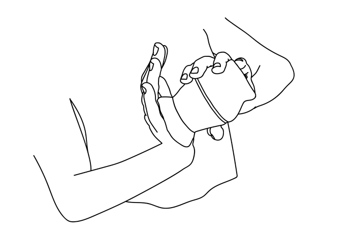

<!-- omit in toc -->
# **Preparing Mate**  User Manual
by Anna Meyer, 14 Jan 2022
<!-- omit in toc -->
## Contents  
- [About this manual](#about-this-manual)
- [Introduction](#introduction)
- [Glossary](#glossary)
- [Before you start](#before-you-start)
- [How to prepare *mate*](#how-to-prepare-mate)
- [How to prepare *tereré*](#how-to-prepare-tereré)

## About this manual 
The aim of this user manual is to guide you through the process of preparing mate. The manual contains a glossary of the terms used in it, a list of the things you need, a step-by-step instruction of preparing mate, and a short description of how to prepare tereré.

## Introduction
**Mate** is a traditional South-American caffeine-rich drink. It is prepared by soaking dried leaves of **yerba mate**, in hot water. Mate is served with with a straw called bombilla, in a special container – mate cup.

## Glossary
- Bombilla – A drinking straw used to drink mate. Bombillas are made of hollow-stemmed cane, metal alloys, stainless steel, and silver.  
- Food thermometer –  A thermometer that is safe to use with food and drinks.
- Mate –  A traditional South-Aerican drink prepared by soaking yerba mate leaves in **hot** water.
- Mate cup –  A special containter in which mate is prepared.
- Tereré – A traditional South-Aerican drink prepared by soaking yerba mate leaves in **cold** water.
- Yerba mate – A holly species *Ilex paraguariensis*. Dried leaves of this plant are used to prepare the drink called mate.

## Before you start
To prepare mate, you need:  
- Yerba mate  
- A mate cup  
- A bombilla  
- A food thermometer  
- A kettle  
- Water  

## How to prepare *mate*
1. Boil at leat one cup (aroun 250 ml) of water. Leave the water to cool down.
2. Fill the mate cup with yerba mate up to 2/3 of the cup’s volume.
3. Tilt the mate cup, cover it with your hand, turn it upside down, and shake it.  
   
   
   
4. Tilt the mate cup so that the yerba mate leaves rest on the side of the cup.
5. Blow or rinse off the mate dust from your hand that covered the mate cup. Mate dust can stain anything you touch.
6. Place the bombilla inside the hollow space of the mate cup.
7. Turn the mate cup to an upward position.  
8. Check the temperature of the boiled water. It has to be around 75ºC (between 70º and 80ºC).
9. Slowly pour water into the mate cup. Fill it completely.
10. Leave the mate to infuse for 3 to 5 minutes.

        Note: Depending on the type of yerba mate, you infuse the leaves from 3 to 5 times. Check the information on the packaging.

## How to prepare *tereré*
To prepare tereré, a cold infusion of yerba mate, follow the instruction for making mate with some alterations:  
- fill the mate cup to 3/4 of the cup’s volume;
- use cold water or juice;
- optionally: add some ice cubes.
